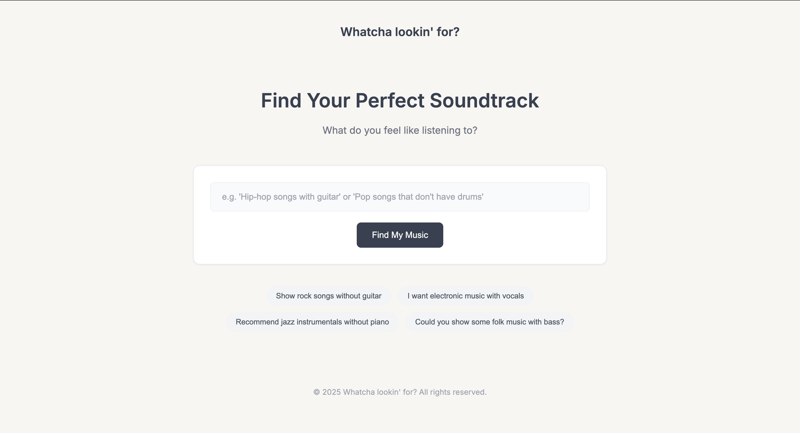

# Whatcha lookin' for?

[](https://ismir.net)
[](https://neurips.cc)
[](https://whatcha-lookin-for.vercel.app/)



A prompt-based music recommendation app. Type what you feel like listening to (e.g., “Hip-hop songs with guitar” or “Jazz without piano”) and get matching tracks from a local SQLite database via an LLM-generated, validated SQL query.

- Frontend: `frontend/index.html` (static HTML/CSS/JS)
- Backend: FastAPI (`backend/api.py`)
- LLM: Groq API (`llama-3.3-70b-versatile`)
- DB: SQLite (`backend/song_database_trial.db`)

## Live/Deployment
- Backend example (Render): `uvicorn backend.api:app --host 0.0.0.0 --port 8000` (see `render.yaml`)
- Frontend example (Vercel/Static): `frontend/index.html` targets:
  - Local: `http://127.0.0.1:8000`
  - Prod: `https://whatcha-lookin-for.onrender.com`
If your deployment domains differ, update the URLs in `frontend/index.html`.

## API
POST `/query`
- Request: `{"prompt": "rock songs without guitar"}`
- Response: `{"results": [{"title": "...", "artist": "...", "album": "...", "listeners": 12345, "genres": ["..."]}]}`

Example:
```bash
curl -X POST http://127.0.0.1:8000/query \
  -H "Content-Type: application/json" \
  -d '{"prompt":"electronic music with vocals"}'
```

## Quickstart

### 1) Install dependencies
```bash
python -m venv .venv
source .venv/bin/activate  # Windows: .venv\Scripts\activate
pip install -r requirements.txt
```

### 2) Environment variables
Create `.env` (gitignored) in the repo root:
```
GROQ_API_KEY=your_groq_api_key_here
```

### 3) Run the backend
```bash
uvicorn backend.api:app --reload --host 127.0.0.1 --port 8000
```
Default DB path: `backend/song_database_trial.db` (set in `backend/api.py`).

### 4) Run the frontend
Open `frontend/index.html` directly in the browser, or serve:
```bash
python -m http.server 5173
# then open http://127.0.0.1:5173/frontend/index.html
```

## Data processing (optional)
Supporting scripts if you rebuild the database:
- `backend/run_all.py`, `backend/postprocess.py`, `backend/extractor.py`, `backend/separate_stems.py`, `backend/webscraping.py`
Not required for running the app with the provided SQLite DB.

## Security
- No secrets are committed.
- `.env` is gitignored; set `GROQ_API_KEY` for the backend (used in `backend/prompt_to_sql.py`).
- Configure the key in your hosting provider’s dashboard (Render, etc.).

## Forking and deploying your own copy
Render and Vercel issue unique URLs per deployment, so forks should:
- Update the backend URL in `frontend/index.html` (`API_BASE_URL`) to your own Render URL, or keep `localhost` for local development.
- Update the CORS allowlist in `backend/api.py` (`allow_origins`) to include your frontend domain.
- Set `GROQ_API_KEY` as an environment variable in your hosting provider.

Tip: For teams, consider moving the frontend API URL to an environment variable or a small config file to avoid manual edits per fork.

## License
MIT. See `LICENSE`. If you include data/models, consider adding an additional note or separate license for those assets.
